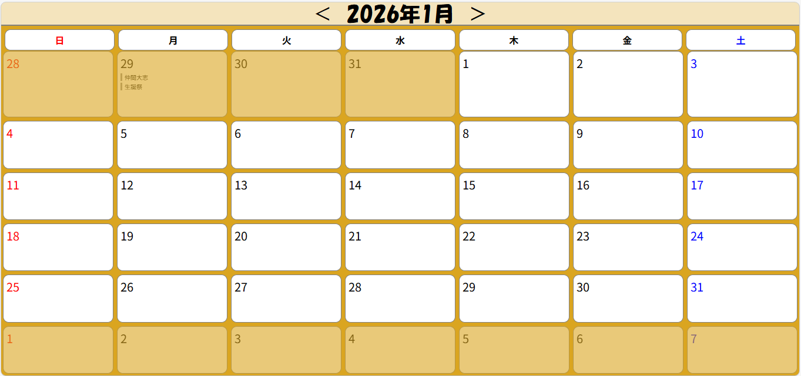
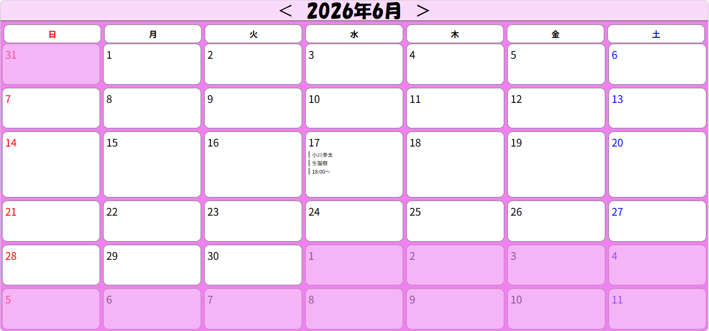

# カレンダーアプリ

HTML / CSS / JavaScriptで作成したカレンダーアプリです。  
月ごとのカレンダー表示、月切り替え、予定表示機能を実装しています。

---

## アプリ画面

### 1月のカレンダー

### 6月のカレンダー

---

## デモ動画

アプリの動作はこちらの動画で確認できます。

https://youtu.be/Om4OEajf9NE

---

## 使用技術

- HTML
- CSS
- JavaScript
- jQuery

---

## 主な機能

- 月ごとのカレンダー表示
- 日付の自動生成
- 前月 / 次月の切り替え
- 日付クリックで予定表示
- 月ごとに背景色を変更

---

## 工夫した点

- CSS Gridを使用してカレンダーのレイアウトを作成
- JavaScriptで日付を自動生成
- jQueryを使用してイベント処理を実装
- 日付クリックで予定を表示する機能を追加

---

## 学んだこと

- DOM操作
- JavaScriptでの日付処理
- jQueryによるイベント処理
- CSS Gridレイアウト

---

## 今後の改善案

・予定の追加 / 編集 / 削除機能の実装  
・予定をLocalStorageに保存する機能の追加  
・レスポンシブ対応（スマートフォン対応）  
・祝日データの表示  
・デザインの改善
